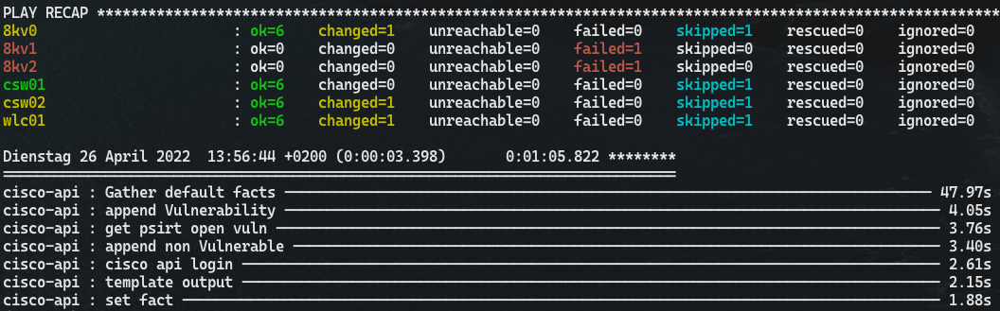

[](https://github.com/oliverl-21/ansible-role-cisco-api/actions/workflows/release.yml)

# ansible-role-cisco-api

| | |
|:---:| :---: |
|[ToDo](#todo) | [Sample Report](sample/report.md) |

Ansible Role for Cisco PSIRT and Support API to query

- OpenVuln
- EoX - future
- Recommended Software - WiP
  - requests done
  - ToDo: generate output

## Current Tasks

- get software version and OS-Type of a device
- Query Cisco OpenVuln API for known vulnerabilities.
- Parse json response for vulnerabilities and append to a report based on a Jinja2 template.
- If errorCode for non vulnerable version is thrown by Cisco API, append to report Device, current version and errorMessage

## ToDo

- implement EoX
- implement Recommended Software

## Requirements

Access to [Cisco API Console](https://apiconsole.cisco.com/)

How-To [link](https://community.cisco.com/t5/services-documents/accessing-the-cisco-psirt-openvuln-api-using-curl/ta-p/3652897)

## Role Variables

- client_id: ```your API client id```
- client_secret: ```your client secret```
- psirt_path: ```path for report export```
- psirt_report: ```filename for the report```
- pss_client_id: ```your PSS API client id```
- pss_client_secret: ```your PSS API client secret```

## Dependencies

Roles: none
Collection:

- cisco.ios
- ansible.netcommon

## Example Playbook

```yaml
# playbook.yml
---
- name: openvuln
  hosts: ios
  gather_facts: false
  connection: network_cli
  vars:
    client_id: <your client id>
    client_secret: <your client secret>
    pss_client_id: <your PSS client id>
    pss_client_secret: <your PSS client secret>
    psirt_path: report
    psirt_report: report.md
  roles:
    - {role: cisco-api, psirt: true, recsw: true}
```
## Sample Output




6 Devices queried, 2 of them unreachable

## License

GPL-3.0-or-later

## Author Information

oliverl-21
